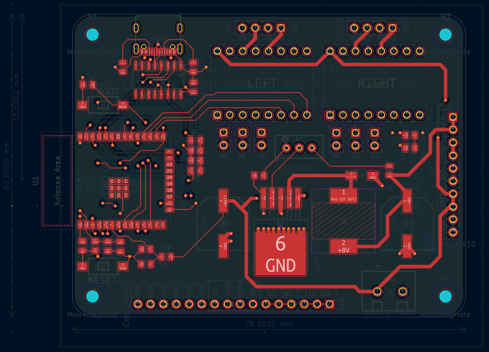
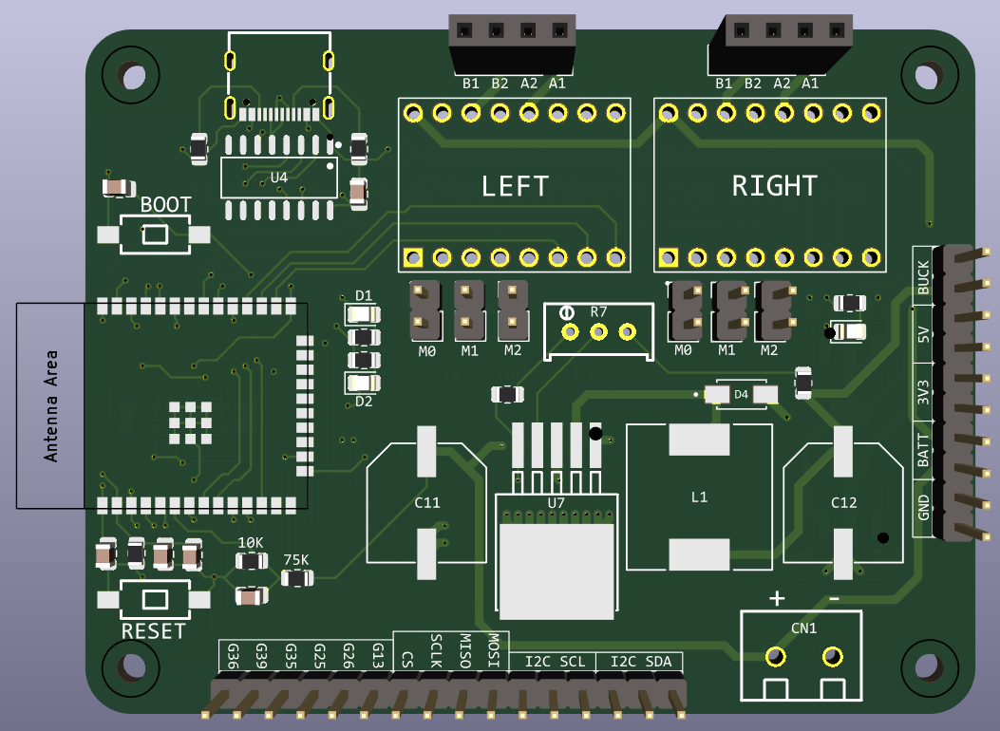

### ESP-WROOM-32 Based Stepper Motor Controller

PCB integrating an ESP-WROOM-32 microcontroller with two A4988/DRV8825 stepper motor drivers.

This is a four layer PCB that I originally designed this for an ESP-32 controlled, NEMA17 powered robot.  However it can also be useful for any other application requiring microcontroller control, stepper motors, and any form of SPI or I2C peripheral.

-----

Before connecting and driving the DRV8825, ensure that you set the current limit on both DRV8825/A4988 stepper drivers.

Features include:
 - 'Battery drive'.  Drive the board through a high voltage li-ion or LiPo battery, but enjoy three additional voltage rails:
    - 'Buck', aka the output from the onboard switching buck converter.
    - 5V rail through an onboard 5V LDO.
    - 3V3 rail through an onboard 3V3 LDO.
 - USB-C fast USB programming and UART.
    - USB-C programming for easy cable manipulation, but only fast USB (ie USB 2.0 speed specification) is supported.
    - 'Auto program' (utilizing USB to place the MCU in program mode) is supported.
 - Sleep, step, and direction pin connections for two DRV8825 stepper motor drivers.  Control speed, direction, and sleep on/off (useful for low current operation) for two steppers individually.
    - This was designed with the thought that each controller would be handled via the ESP-32 MCPWM peripheral, but it's entirely feasible to control them through software if desired.
 - Breakout for SPI.
 - Breakout for I2C.
    - Three pins each for both I2C SDA and SCL.
 - Voltage divider / voltmeter for 'battery' voltage.
 - Breakouts for ESP-32 GPIOs 13, 25, 26, and 36.
    - These were unused in the original design, but can be handy for extra outputs (eg another SPI CS pin) or inputs.
 - Pin headers for 1/8, 1/16, and 1/32nd microstepping.
    - Each stepper driver can be independently set for microstepping as required by your application.

